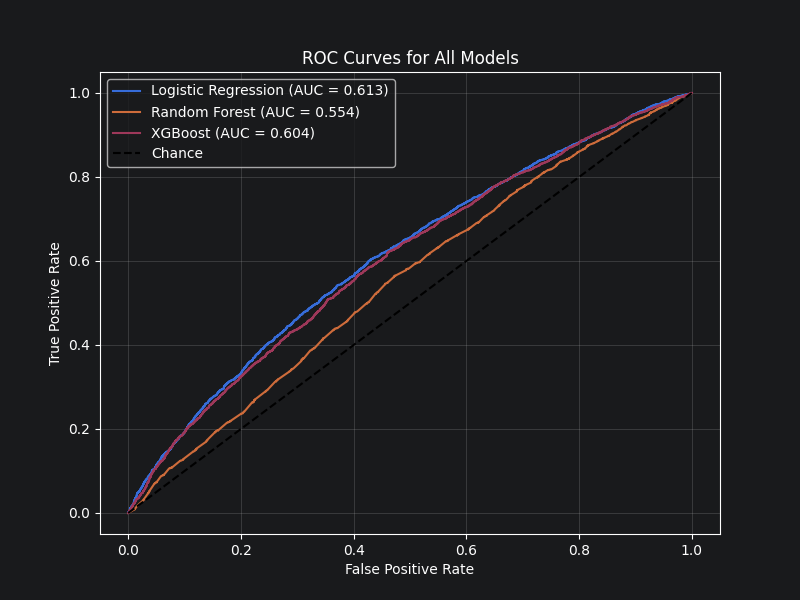
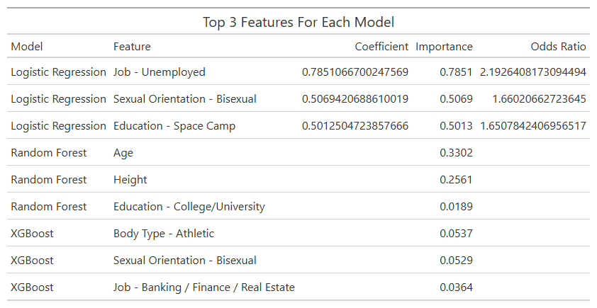

# Are you at cat person?

This project creates machine learning (ML) models  [OKCupid dating profiles](https://www.kaggle.com/datasets/yashsrivastava51213/okcupid-profiles-dataset) predicting if a person will like cats.

The following ML techniques have been used so far:

- Logistic Regression
- Random Forests
- XGBoost

This dataset contains relatively weak predictors for the outcome (opinions can be hard to predict!), but it is interesting to see what features are the most influential and how each model performs in this context.

# Current Results

The models run so far have only had accuracy slightly above random chance, so nothing to write home about. However, it is interesting that the simplest model, the logistic, has the greatest AUC.

The following are the top 3 most important features for each model:

Further work is going to use natural langauge processing (NLP) on the essay variables and incorporate them into the models to see if this improves results

